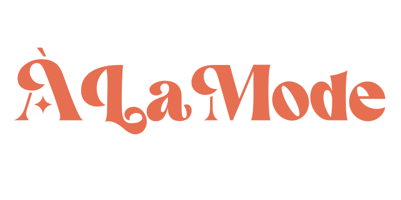
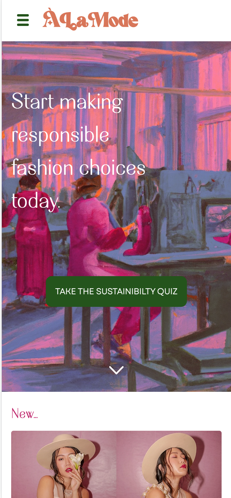
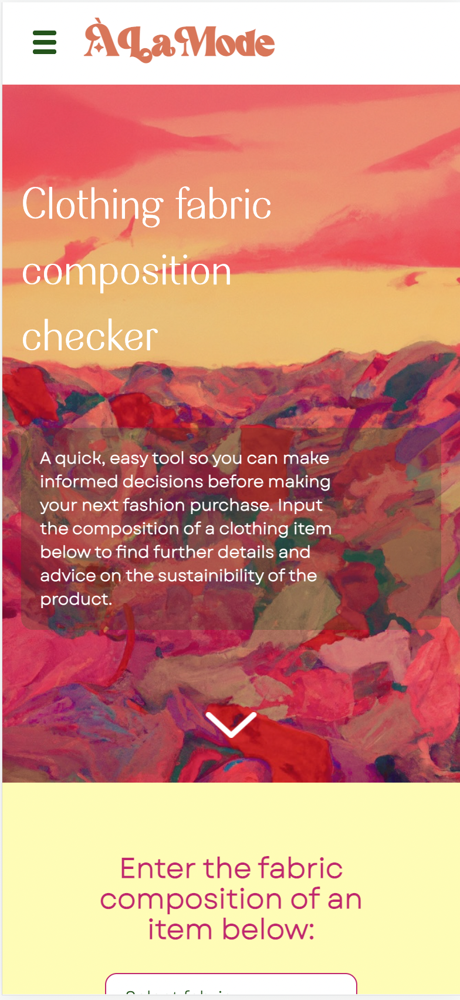

**Striving for education, mindfulness and positive change within fashion.**

## V1 

`The problem`

- Fashion is a huge contributor to the current climate crisis - causing 10% of human caused greenhouse gas emissions, 10% of global waste water, 53 million tonnes of clothing sent to landfill every year

- 48% of UK adults have not adopted more sustainable habits due to lack of information.

- We must change our attitudes and consumption habits fast, but how can we make change without knowing where to start?

`The solution`

ÀLaMode - the one stop resource for all things fashion sustainibility.

A full stack mobile react app that gives users easily digestible information and practical advice on how to adopt more sustainable fashion habits.

## Installation

Install alamode with npm

```bash
  npm install alamode
  cd alamode
```

## Run Locally

**Visit https://github.com/GeorgiaPlitsch/alamode-server to install and run the back end**

Clone the project

```bash
  git clone https://github.com/GeorgiaPlitsch/alamode
```

Go to the project directory

```bash
  cd alamode
```

Install dependencies

```bash
  npm install
```

Start the server

```bash
  npm run start
```

## Features

- **Fashion Sustainability Quiz**
  A tool to help measure your current sustainability levels and to help you make a suitable next step.
  Complete the fashion sustainability quiz to find out the sustainability rating score of your current fashion consumption habits and receive a personalised reccomended next step based on your main concern around sustainable fashion.

- **Clothing Composition Checker**
  A tool to ensure you can make informed decisions before purchasing a fashion item. Input the fabric composition of a clothing item to receive clear advice and info on the sustainability levels of the fabrics, along with reminders of other important factors to consider.
- **Articles**
  Browse infortmative articles on fashion sustainability
- **Forum**
  Browse forum discussions (currently read only, use auth and post functionality coming soon on V2)

-Currently developed for mobile, full responsiveness comong soon on V2

## Tech Stack

**Client:** React, JS, HTML, CSS/SASS, AXIOS, npm

**Server:** Node, Express

## Screenshots




## API Reference

#### Get all articles

```http
  GET /api/articles
```

#### Get item

```http
  GET /api/articles/${id}
```

| Parameter | Type     | Description                          |
| :-------- | :------- | :----------------------------------- |
| `id`      | `string` | **Required**. Id of article to fetch |

#### Get all fabrics

```http
  GET /api/fabrics
```

#### Get all forum posts

```http
  GET /api/forum
```

#### Get forum post

```http
  GET /api/forum/${id}
```

| Parameter | Type     | Description                             |
| :-------- | :------- | :-------------------------------------- |
| `id`      | `string` | **Required**. Id of forum post to fetch |

#### Get all scored quiz questions

```http
  GET /api/quiz/scored
```

#### Get all reccomendation quiz questions

```http
  GET /api/quiz/rec
```

#### Get all quiz reccomendation resultd

```http
  GET /api/results
```

#### Get a quiz reccomendation result

```http
  GET /api/forum/${id}
```

| Parameter | Type     | Description                         |
| :-------- | :------- | :---------------------------------- |
| `id`      | `string` | **Required**. Id of result to fetch |

## Status

ÀLaMode is currently still under development with V2 coming soon and plans to deploy in the near future.

## Known bugs

- QUIZ:
  After quiz completion, unable to refresh to default state without first visiting another page and returning.
  Quiz score number changes if quiz nav link selected whilst on quiz results are being displayed.
  Back button not currently functional on Q6.

- FABRIC CHECKER:
  If a fabric is entered and then changed to an alternate fabric in that same input field, will still render results for the erased fabric in addition to selected fabrics.

## Lessons Learned

- This project gave me the opportunity to harness my full stack skills and test my abilities in a short time frame (aprox 2 weeks to create V1)
- I learnt that lack of data is a huge barrier for development - we can have an amazing idea however if suitable data is not readily available or accessible, our ideas may not come to life in the way or with the ease we hope
- The project further reinforced the value of a strong git workflow, ensuring I was able to easily and quickly able to backtrack changes if necessary
